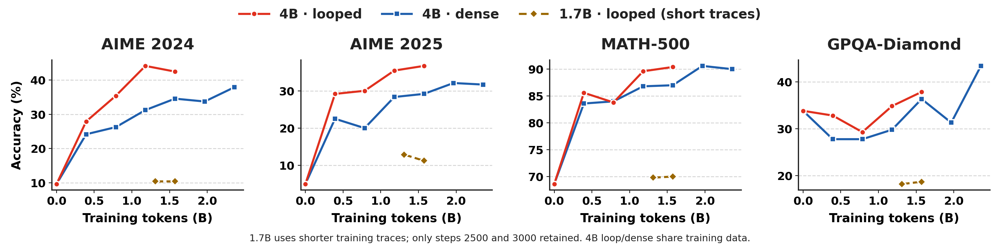
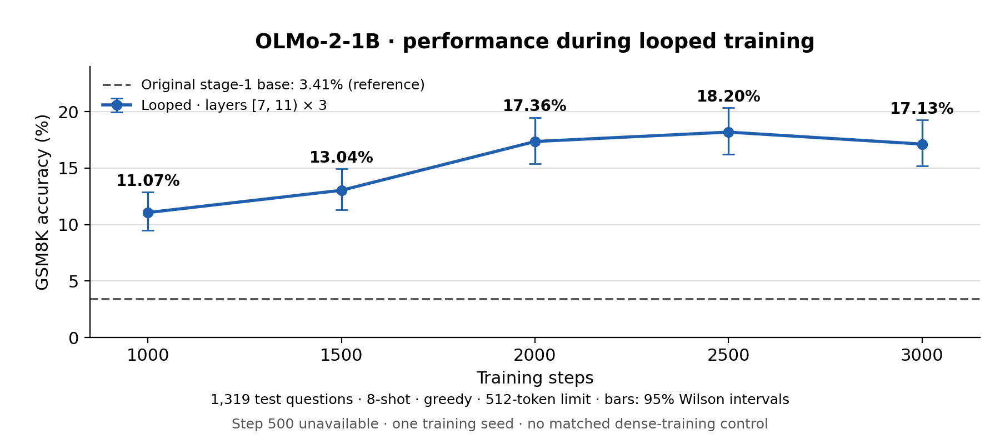

<p align="center">
  <picture>
    <source media="(prefers-color-scheme: dark)" srcset="docs/logo/open-loopify-logo-dark.svg">
    
  </picture>
</p>

<p align="center"><b>Make a pretrained model think deeper by running its own layers more than once — no new parameters.</b></p>

open-loopify loops a span of a released model's layers — for Qwen3-4B, layers 13–21 run three
times, 54 blocks of compute per token instead of 36 — mid-trains it on open reasoning data, and
exports an ordinary checkpoint that `transformers` and vLLM load with no custom code.

**🤗 Weights:** [Qwen3-4B](https://huggingface.co/tyzhu/open-loopify-Qwen3-4B) · [Qwen3-1.7B (step 3000)](https://huggingface.co/tyzhu/open-loopify-Qwen3-1.7B) on the Hugging Face Hub.

## ✨ Highlights

- 🔁 **Loop a pretrained model** — pick the layers and how many times they run. The recipe below
  is for Qwen3.
- 🏋️ **Full training pipeline** on [nanotron](https://github.com/huggingface/nanotron), with a
  dense control generated from the same config.
- 📦 **Ships as an ordinary checkpoint** — the loop is unrolled on export.
- 📊 **Reasoning evaluation** — AIME 2024/25, HMMT Feb 2025, AMC 2023, MATH-500, GPQA-Diamond.
  Interrupted runs resume.
- 🧹 **Clean reasoning data** — traces that were cut off by their generator's length limit are
  filtered out before training.

## 📊 Results

Qwen3-4B-Base, layers [13, 22) looped 3×, mid-trained on 1.57B tokens of open reasoning traces
(one 8×A100-80GB node, 23 hours):

| model | AIME 2024 | AIME 2025 | HMMT Feb 2025 | AMC 2023 | MATH-500 | GPQA-Diamond |
|---|---|---|---|---|---|---|
| Qwen3-4B-Base | 9.6 | 5.0 | 0.4 | 42.5 | 68.6 | 33.8 |
| **+ open-loopify** | **42.5** | **36.7** | **22.5** | **80.3** | **90.4** | **37.9** |
| Qwen3-4B (official, with large-scale RL) | 62.1 | 47.1 | 32.9 | 88.4 | 94.0 | 53.5 |

Given 28k tokens to think instead of 16k (`--max-tokens 28672` in [Evaluate](#-evaluate)) it reaches
50.0 / 41.2 / 24.6 on AIME 2024 / AIME 2025 / HMMT.

**Qwen3-4B: looped vs dense on the same data.** Both start from Qwen3-4B-Base and see the same tokens in
the same order; the only difference is the loop.



For Qwen3-4B, at equal training tokens the looped model is ahead almost everywhere (15 of 16 comparisons). At
equal compute — the dense model trained 1.5× longer — the looped model still leads on competition
math (AIME 2024/25 and HMMT Feb 2025: +3.6 points, 95% CI [+0.6, +6.8]; +6.5 [+2.5, +10.7] with
28k tokens to think), ties on MATH-500 and trails on GPQA-Diamond.

The gold dashed curves show **Qwen3-1.7B**, with layers [12, 19) looped 3× and
six measured checkpoints from steps 500 to 3000 (0.26–1.57B training tokens). This run uses
complete reasoning traces of at most 8,000 tokens and has **no matched 1.7B dense control**;
it is not an ablation against the 4B dense model. MATH-500 rises from 51.4% to 70.0%.

All four panels use a 16k output limit, temperature 0.6 and top-p 0.95. AIME reports the
average accuracy across eight samples per question (30 questions per year), not pass@8;
MATH-500 and GPQA-Diamond use one sample. Results use one training seed, and different
batch schedules need not reproduce identical sampled text. See [Evaluate](#-evaluate).

### OLMo-2-1B: checkpoint performance

We also loop layers [7, 11) three times in OLMo-2-1B and train for 3,000 steps
(1.57B tokens). Five retained checkpoints are evaluated on the same 1,319 GSM8K test
questions: 8-shot plain prompts, greedy decoding, a 512-token output limit, and batch size 16.

<p align="center">
  
</p>

Accuracy reaches 18.20% at step 2500 and 17.13% at step 3000, versus 3.41% for the original
stage-1 base. This is one training seed with **no matched dense-training control**; it does
not isolate the effect of looping from continued training. Error bars are 95% Wilson
intervals over test questions, not training-seed variability. The 500-step checkpoint was
pruned before retention was requested. The base is a reference, not loop step 0; this GSM8K
protocol differs from the Qwen reasoning benchmarks above.

## ⚙️ Install

Needs Linux, an NVIDIA driver for CUDA 12 (≥ 525), and `g++`/`make` (the data loader compiles a
small C++ helper on first use). Training the 4B recipe takes 8 GPUs with 80 GB each; using or
evaluating a model takes one.

```bash
git clone https://github.com/tongyao-zhu/open-loopify && cd open-loopify
conda create -n loopify python=3.10 -y && conda activate loopify
pip install -e . https://github.com/Dao-AILab/flash-attention/releases/download/v2.7.4.post1/flash_attn-2.7.4.post1+cu12torch2.6cxx11abiFALSE-cp310-cp310-linux_x86_64.whl
```

Evaluation runs on vLLM, which pins its own torch — give it a separate environment:

```bash
conda create -n loopify-eval python=3.10 -y && conda activate loopify-eval
pip install vllm==0.13.0 math-verify==0.9.0 datasets==4.2.0
```

## 🚀 Use a looped model

An exported model is an ordinary checkpoint:

```python
import torch
from transformers import AutoModelForCausalLM, AutoTokenizer

path = "tyzhu/open-loopify-Qwen3-4B"  # or your own export, e.g. hf/qwen3-4b-loop/full_model
tok = AutoTokenizer.from_pretrained(path)
model = AutoModelForCausalLM.from_pretrained(path, dtype=torch.bfloat16).cuda()

question = "What is the sum of all positive divisors of 36?"
prompt = f"{question}\nPlease reason step by step, and put your final answer within \\boxed{{}}."
inputs = tok.apply_chat_template([{"role": "user", "content": prompt}], add_generation_prompt=True,
                                 return_dict=True, return_tensors="pt").to(model.device)
out = model.generate(**inputs, max_new_tokens=16384, do_sample=True, temperature=0.6, top_p=0.95)
print(tok.decode(out[0, inputs["input_ids"].shape[1]:], skip_special_tokens=True))
```

Or serve it: `vllm serve tyzhu/open-loopify-Qwen3-4B`. Give it room to think — answers often run
5k–15k tokens.

## 🔁 Loop your own model

**Choose which layers to repeat, and how many times to run them:**

```bash
--loop 13:22:3
```

The format is `START:END:K`, with **zero-based layer indices**:

| Parameter | Example | Meaning |
|---|---|---|
| `START` | `13` | First layer in the repeated span, included |
| `END` | `22` | End of the span, excluded |
| `K` | `3` | Total passes through that span |

For the 36-layer Qwen3-4B model, this runs layers 13–21 three times:

```text
layers 0–12 → [layers 13–21] × 3 → layers 22–35
```

The repeated passes share weights. This gives **54 block executions per token**
(13 + 9 × 3 + 14), while keeping the original 36 sets of layer weights during training.
Change `--loop` to explore a different span or repeat count.

Use the built-in [**reasoning-v1**](data/mixtures/reasoning-v1.json) data mixture from our
Qwen3-4B experiments. Prepare it once with your model's tokenizer, then pass its output
directory to the config generator. The mixture is selected by name; no manual data weights
are needed.

```bash
# 1. Convert the base checkpoint
torchrun --nproc_per_node=1 -m loopify.convert_hf \
    --hf Qwen/Qwen3-4B-Base --out ckpts/qwen3-4b-base

# 2. Prepare the built-in reasoning mixture
python data/prepare_tokens.py --model Qwen/Qwen3-4B-Base \
    --mixture reasoning-v1 --out data/reason

# 3. Choose the loop; generate looped and dense-control configs
python configs/make_config.py \
    --hf Qwen/Qwen3-4B-Base --ckpt ckpts/qwen3-4b-base \
    --loop 13:22:3 \
    --data data/reason \
    --train-steps 3000 --seq-len 16384 --recompute --zero1

# 4. Train (8 GPUs)
torchrun --nproc_per_node=8 run_loopify.py \
    --config-file configs/qwen3_4b_base_loop_s17_recompute_zero1.yaml

# 5. Export as an ordinary Hugging Face checkpoint
torchrun --nproc_per_node=1 -m loopify.export_hf --unroll \
    --ckpt runs/qwen3_4b_base_loop_s17/checkpoints/3000 \
    --hf-ref Qwen/Qwen3-4B-Base --out hf/qwen3-4b-loop
```

`--unroll` writes each repeated pass as a separate layer in the exported checkpoint:
54 layers for this example, loadable with standard Transformers or vLLM.

<details>
<summary>What's in reasoning-v1? Can I use my own data?</summary>

The [versioned recipe](data/mixtures/reasoning-v1.json) combines:

| Source | Sampling share | Length filter |
|---|---|---|
| [OpenThoughts3](https://huggingface.co/datasets/open-thoughts/OpenThoughts3-1.2M) | 2/3 | Drop traces of 15,000 tokens or more |
| [OpenR1-Math](https://huggingface.co/datasets/open-r1/OpenR1-Math-220k) | 1/3 | Disabled for this recipe |

The preset prepares up to 3.2B and 600M tokens respectively, using the model's chat template
and tokenizer. The token files need up to about 15.2 GB, in addition to the Hugging Face
download cache. A completed preparation can be reused with the same tokenizer.

The output directory contains a `manifest.json` with the mixture's sampling weights.
`make_config.py --data data/reason` reads it automatically and checks that its shards are
complete and the tokenizer matches `--hf`. The same mixture is used for looped and dense
configs. Training duration is still controlled by `--train-steps`.

For your own data, pass token folders made with the same tokenizer:
`--data data/my_tokens`, or `--data data/source_a data/source_b`. Individual folders are
sampled in proportion to their token counts; advanced users can override this with
`DIR:WEIGHT`. Custom preprocessing remains available through `prepare_tokens.py --sources`
(see `--help`).

</details>

<details>
<summary>Dense controls and equivalence checks</summary>

`make_config.py` also writes a dense-control config using the same model, data, seed, and
training schedule. To match the looped model's compute as well as its data mixture, train the
dense model longer by the block-execution ratio — here 54 / 36 = 1.5. Add
`--arms dense --train-steps 4500 --tag compute` to the config command, replacing its
`--train-steps 3000`. The tag gives this run its own directory.

Two checks worth running once per model:

```bash
# With no loop, the converted model must reproduce the original.
torchrun --nproc_per_node=1 tools/check_equivalence.py --hf Qwen/Qwen3-4B-Base

# The unrolled export must reproduce the looped model.
torchrun --nproc_per_node=1 tools/check_unroll.py --hf Qwen/Qwen3-4B-Base \
    --loop-start 13 --loop-end 22 --loop-k 3
```

</details>

## 🧪 Evaluate

```bash
conda activate loopify-eval
python tools/eval_reason.py generate --model hf/qwen3-4b-loop/full_model --out results/qwen3-4b-loop \
    --benchmarks aime24,aime25,hmmt25,amc23,math500,gpqa
python tools/eval_reason.py grade --out results/qwen3-4b-loop
```

Zero-shot with the chat template, temperature 0.6, top-p 0.95, up to 16k generated tokens; AIME,
HMMT and AMC are averaged over 8 samples per problem. GPQA-Diamond is gated on the Hub: accept its
terms and run `hf auth login` first, or leave `gpqa` out. A run that is interrupted picks up where it
stopped when started again with the same `--out`.

## 📁 Files

```
src/loopify/
  config.py        LoopifyConfig: loop span and count, plus Qwen3 / OLMo-2 architecture knobs
  model.py         the loop: prelude, repeated span, coda
  data.py          per-source shuffling of training windows
  convert_hf.py    Hugging Face -> nanotron
  export_hf.py     nanotron -> Hugging Face, with --unroll for a plain checkpoint
configs/make_config.py   looped + dense configs from one source
data/mixtures/           built-in, versioned data recipes
data/prepare_tokens.py   download, filter, tokenize and pack training data
run_loopify.py           training entry point
tools/                   equivalence checks and evaluation
docs/nanotron-changes.md what this fork changes in nanotron
docs/logo/               project logo assets
```

## 📚 Related work

We generally follow the approach from [Retrofitted Recurrence](https://arxiv.org/abs/2511.07384),
applying recurrence to a subset of layers in a pretrained model during mid-training.
Related work includes [ETD](https://arxiv.org/abs/2510.07358) (Encode-Think-Decode),
[Huginn](https://github.com/seal-rg/recurrent-pretraining), [Ouro](https://ouro-llm.github.io/),
[Relaxed Recursive Transformers](https://arxiv.org/abs/2410.20672), and
[Loopie](https://arxiv.org/abs/2607.16051).

## License

Apache-2.0, like nanotron. Training data (OpenThoughts3-1.2M, OpenR1-Math-220k) is Apache-2.0.

## 📝 TODO

- [ ] Add more model families and sizes.
- [ ] Explore different layer-looping strategies.
- [ ] Combine LoRA fine-tuning with layer looping.
